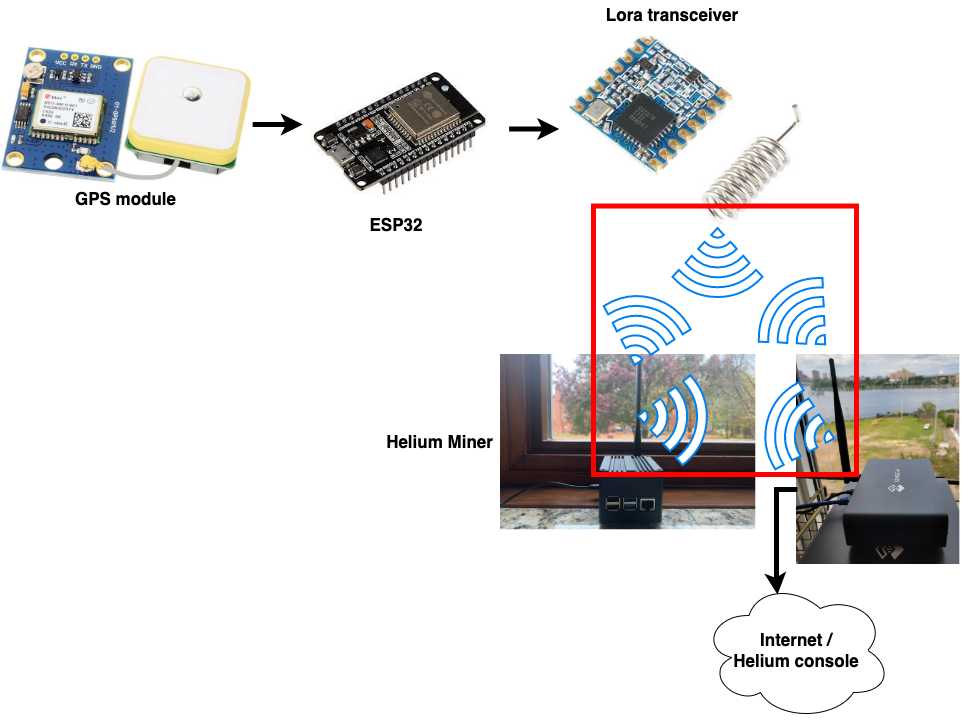
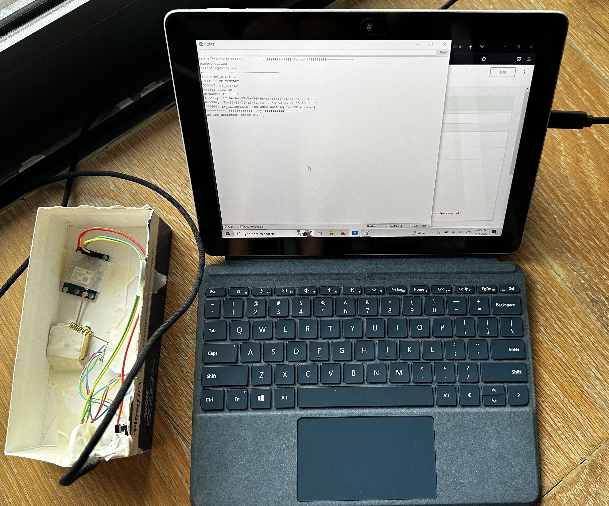
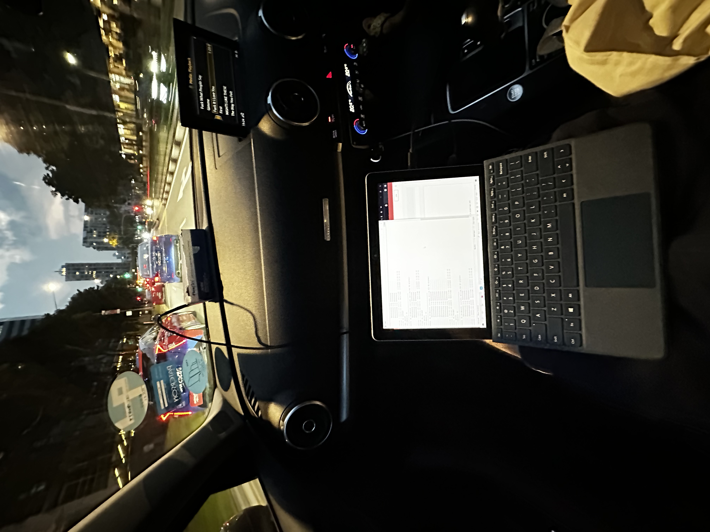
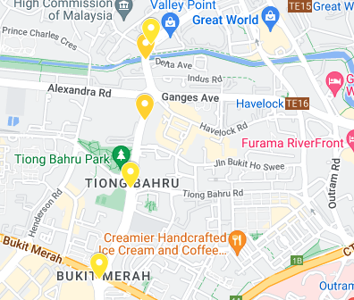
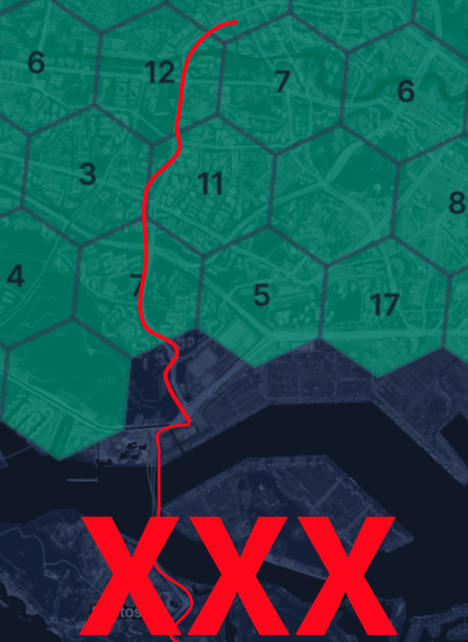
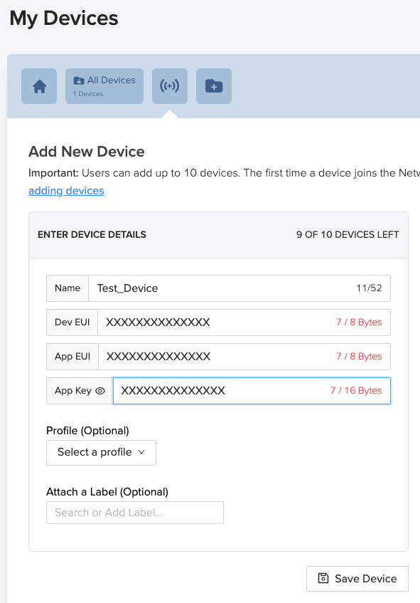
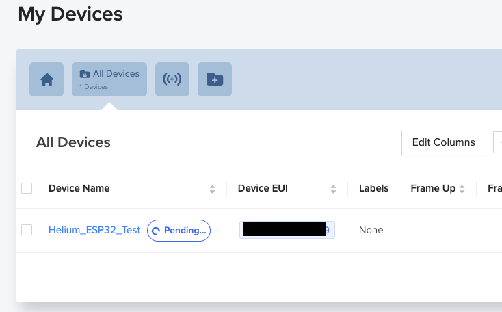
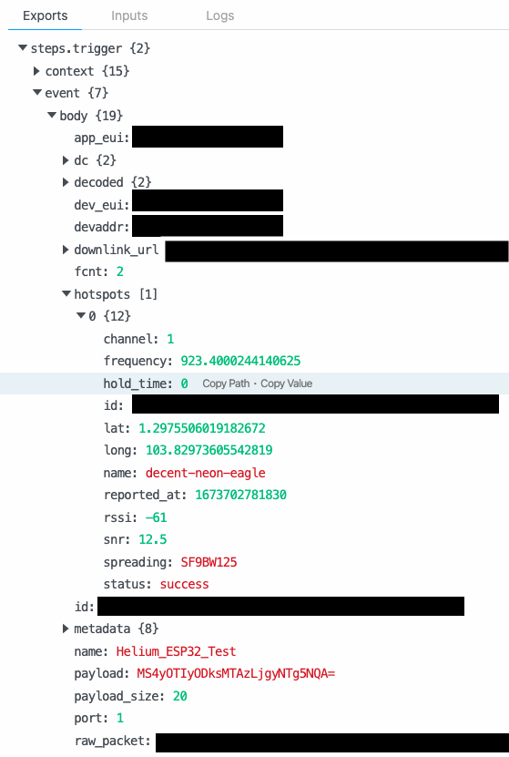
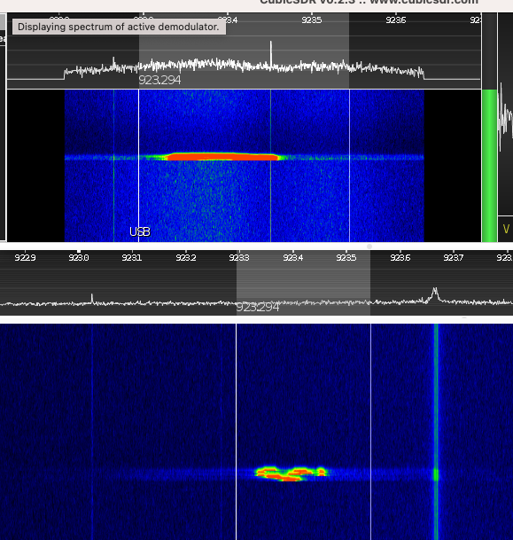

# Building a prototype to send GPS location data to the Helium (Lora) network


This project provides step-by-step instructions for building a prototype device that sends GPS location data to the Helium (Lora) network. The prototype utilises an ESP32 development board, a Lora RFM95W 915MHZ (SX1276) module, and a GPS module (GY-GPS6MV2). The instructions cover connecting the Lora and GPS modules to the ESP32 board, adding the device to the Helium network, and setting up a test/debug environment using pipedream.com. The file also includes images to assist in the building process.


 

## The GPS/Helium test drive though Singapore

Helium GPS prototype         |  Connection test drive
:-------------------------:|:-------------------------:
  |  

Test drive successful transmits|  Helium hotspot map(explorer.helium.com)
:-------------------------:|:-------------------------:
   |  


## How to use the code

### Components
- Lora RFM95W 915MHZ (SX1276) - Make sure you have the correct board with frequency you need!
- ESP32 development board
- GPS module (GY - GPS6MV2)

### Connect the lora module
| ESP32| SX1276 |
| --- | --- |
| GPIO34 | DIO0 |
| GPIO35 | DIO1 |
| GPIO33 | DIO2 |
| GPIO23 | MOSI |
| GPIO18 | SCK |
| GPIO19 | MISO |
| GPIO4 | RESET/RST |
| GPIO5 | NSS |
| 3V3 | 3.3V |
| GND | GND |

### Connect the GPS module
| ESP32| GPS6MV2 |
| --- | --- |
| RX2 | TX |
| TX2 | RX |
| VIN(5V) | VCC |
| GND | GND |     


### Add you device to the Helium network

Go to the Helium console (console.helium.com/devices) and add a new device (see below). You will need later the "Device EUI", "App EUI" and "App Key".


Add a new device        |  Pending device creation
:-------------------------:|:-------------------------:
  |  

### Set up your test/debug environment (Optional)

I used pipedream.com to receive, temporary store and retrieve the packages I sent it the Helium network. You can sign up (pipedream.com/auth/signup) and get the payload of you your packages (see below).

You will also need to add a new integration (console.helium.com/integrations/new) in the Helium console to add the pipedream endpoint as receiver of your messages. Furthermore you need to create a flow in the Helium console (console.helium.com/flows) which then instruct the Helium console to send the packages to pipedream (see below).


Helium console flow (console.helium.com/flows)          |  pipedream.com
:-------------------------:|:-------------------------:
  |  

### Setting up the Arduino environment


<ul>
  <li>1. Install "MCCI Arduino LoRaWAN LMIC library" (https://github.com/mcci-catena/arduino-lorawan/)
  <ul>
    <li>1.1 Go to Sketch > Include Library > Manage Libraries. </li>
    <li>1.2 In the search bar, type in the name of the library you wish to install and click 				on the library in the search results.</li>
    <li>1.3 Click on the "Install" button to install the library.</li>
    </ul>
  </li>
  
  <li>2. Change the "lmic_project_config.h" file
    <ul>
    <li>2.1 Go to "/libraries/MCCI_LoRaWAN_LMIC_library/project_config/lmic_project_config.h" </li>
    <li>2.2 Add the lines below and comment or remove everything else</li>
    </ul>
  </li>
  
    <li>3. Add your "Device EUI", "App EUI" and "App Key" to the "helium_crd.h" file.
    <ul>
    <li>2.1 "Device EUI" needs to be added as LSB (Little-endian). </li>
    <li>2.2 "App EUI" also needs to be added as LSB.</li>
    <li>2.3 But "App Key" needs to be added as MSB.</li>
    </ul>
  </li>
</ul>


"lmic_project_config.h" file

```
#define CFG_as923 1
#define CFG_sx1276_radio 1
#define LMIC_LORAWAN_SPEC_VERSION LMIC_LORAWAN_SPEC_VERSION_1_0_3
```
Configuration are meant to be used for the Singapore/AS923 frequency.

"helium_crd.h" file.
Example: APPEUI from the Helium console "123456890abcdef"
```
static const u1_t PROGMEM APPEUI[8] = { 0xEF,0xCD,0xAB,0x90,0x78,0x56,0x34,0x12};
```


## What if it does not work?

- Make to have the correct module with the right frequency!
- Make sure you added "Device EUI", "App EUI" and "App Key" in the right order and you do not have any mistakes in it.
- Make sure you are close to (ideally to several) Helium hotspots (explorer.helium.com).
- Check your cabling!
- Helium/Lora is very time sensitive protocol (based on the internet) make sure you do not delay or block the "os_runloop_once()" function for too long. The function needs to be called constantly my experience. 
- Your code does not compile right at the beginning after installing the library? Make sure to close and reopen the Arduino IDE.
- Always get "no JoinAccept"? Can mean many things: No hotspot close by, wrong "Device EUI", "App EUI" or "App Key, cable issue, ...


## What to do next?

- Improve the software and some timing issues. 
- Add more debug messages to understand issues better.
- Build a prototype which can be used for an extended time e.g. temperature sensor in a remote area.
- How can we use Software Defined Radio (see below) to better analyse and understand the protocol and issues with a prototype. 

 
